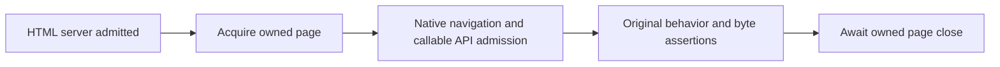

Browser fixture startup now has an explicit owner before storage assertions begin. Run the same public task:

```sh
deno task test:browser tests/browser/iframe.spec.ts tests/browser/readiness.spec.ts --retries=0
```

A retained Chromium cross-origin trace showed navigation complete while the child fixture's module graph was still
loading. The default 30-second test deadline expired; API readiness and the exact embedding assertions completed only
during teardown. The trace does not distinguish cold dependency transforms from browser scheduling or animation-frame
polling. It establishes that the old harness charged unrelated acquisition to the functional body.

HTTP200 still admits each fixture server. A separate Playwright fixture now owns a new page, bounded native navigation
and exact callable API admission before handing it to the test. Numeric polling observes module installation without
requiring a rendered frame. The ordinary body remains 30 seconds; malformed APIs, real load faults and missing readiness
remain failures. While native navigation is in flight, listeners retain load faults without aborting its transaction.
After bounded native navigation settles, recorded faults or failed main-response status refuse admission before API
polling. Later faults can cancel the stable API wait; native rejection and recorded load errors remain independent. The
containing page owns an iframe's retirement, while its provided browser context remains borrowed.



The 90-second fixture slot is shared by setup and teardown in pinned Playwright 1.62.1, with the suspended test body
excluded. Completed acquisition has at most 60 seconds, leaving 30 seconds of that slot for retirement. Native waits
check remaining time before dispatch. Page creation and close have no cancellable timeout of their own, so the framework
and outer watchdog still own a pending native call. A reserved interval is not a guarantee that a hung OS operation
stops.

Tests use the admitted page directly:

```ts
// Inside tests/browser/example.spec.ts
import { expect } from "@playwright/test";
import { test } from "./ready.ts";

test("the fixture exposes a callable probe", async ({ ready: page }) => {
  expect(await page.evaluate(() => typeof Reflect.get(globalThis, "opfsTest")?.probe)).toBe("function");
});
```

Persistence and isolation stories keep their authored writes, actual reloads/closes and independently observed reads in
the body, with explicit finite multi-document scenario owners. Benchmark imports have a separate document admission
before sampling; the timed callbacks and their exact-byte warmup/sample loops remain unchanged. Correctness pages no
longer eagerly import the benchmark support graph. No retry, global suite timeout or capability skip was added. Worker
import handshakes remain a separate review boundary rather than an implied repaired behavior.
